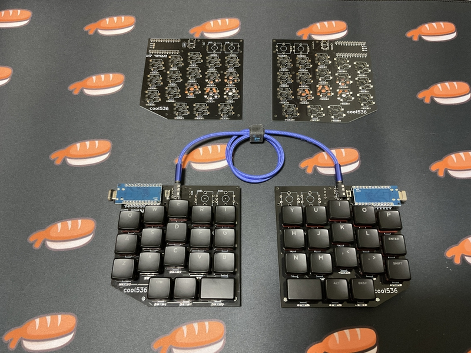
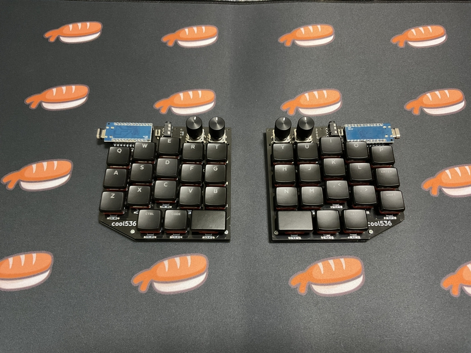

# cool536
## What is cool536？

The coo536 is a 36-key split keyboard.
 
The key layout is column staggered.
  
coo536は36キーの分割キーボードです。
 
キーレイアウトは、カラムスタッガードです。
  
You can choose either choc switch or cherry mx switch to use.
 
Chocスイッチか CHERRY MXスイッチのどちらか一つを選んで使うことができます。
 
 
Up to 4 rotary encoders can be installed. It is also possible to take an OLED display.
  
ロータリーエンコーダーを最大4個取り付けることが可能です。また、OLEDディスプレイも取りけることが可能です。
 

 
The size of the PCB is within 100mmX100mm.
 
It will be distributed on booth in the future, but you can freely use the data here and place an order with the PCB manufacturer.
  
PCBのサイズは、100mmX100mm以内です。
 
将来、boothにて頒布しますが、ここにあるデータを自由に使い、各自がPCB製造元に発注しても構いません。
  
I do not take any responsibility for the data that you freely use.
 
Please use at your own risk.
  
各自が自由に使ったデータについては、私は一切の責任を負いません。
 
自己責任で利用してください。
 

## Build Guide
Preparing now.
 
ただいま準備中。

 

## Firmware
https://github.com/telzo2000/cool536/tree/main/firmware
