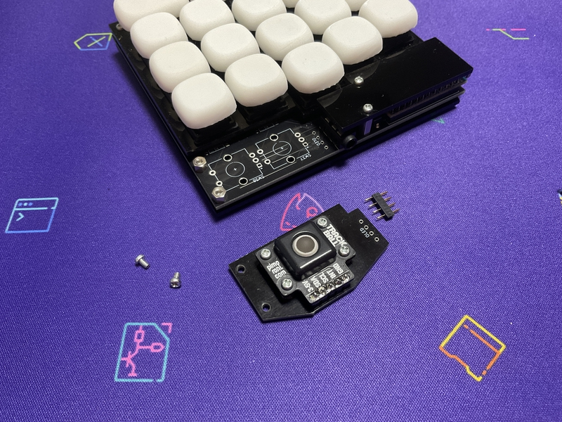
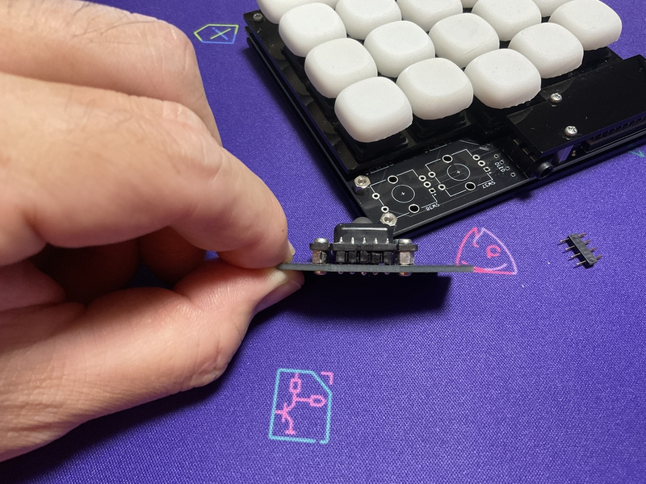
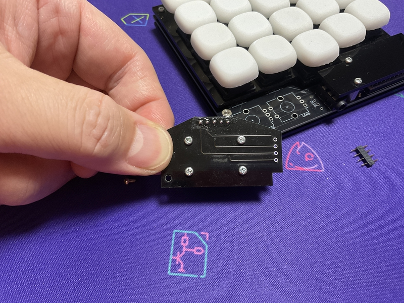

# Build guide

## Parts list

| No. | Patrs | Quantity | remarks | Suppliers | Cost |
|--|--|--|--|--|--|
|番号|名前|数|備考|調達先|参考価格（送料込）| 
|1|PCB|2|40%splite keyboard|[elecrow](https://www.elecrow.com) [JLCPCB](https://jlcpcb.com) [ALLPCB](https://www.allpcb.com)|５枚で10〜20ドル| 
|2-1|Switch Plate スイッチプレート|2|アクリル [Plate data](https://github.com/telzo2000/cool536/tree/main/case_design)|[工房Emerge+](https://www.emergeplus.jp/laser-cutting-service/contact/) [遊舎工房](https://yushakobo.jp) [elecrow](https://www.elecrow.com)|種類による。|
|2-2|Cover Plate カバープレート|2|↑|↑|↑|
|2-3|Bottom Plate ボトムプレート|2|↑|↑|↑|
|3|M2screw M2ネジ|16|4mm CoverPlateで使用 3mmでも代用可|DIYショップなど|10本で100円程度|
|4|M2screw M2ネジ|8|3mm BottomPlateで使用|↑|↑|
|5A|M2screw M2ネジ|8|8mm MXスイッチ使用時SwitchPlateで使用|↑|↑|
|5B|M2screw M2ネジ|8|6mm chocスッチ使用時SwitchPlateで使用|↑|↑|
|6A|M2spacer M2スペーサー|16|3mmメス-メス MXスイッチ使用時|[ヒロスギネット](https://www.hirosugi-net.co.jp/shop/c/c10/) [遊舎工房](https://yushakobo.jp)|20本で800円程度|
|6B|M2spacer M2スペーサー|8|3mmメス-メス chocスイッチ使用時|[ヒロスギネット](https://www.hirosugi-net.co.jp/shop/c/c10/) [遊舎工房](https://yushakobo.jp)|20本で800円程度|
|7|M2spacer M2スペーサー|8|8mmメス-メス CoverPlateで使用|[ヒロスギネット](https://www.hirosugi-net.co.jp/shop/c/c10/) [遊舎工房](https://yushakobo.jp)|20本で800円程度|
|8|pro micro|2|ピンヘッダも別途購入|[遊舎工房](https://yushakobo.jp) [Talp Keyboard](https://talpkeyboard.net) [Daily Craft Keyboard](https://shop.dailycraft.jp)等|価格変動中|
|9A|Swith socket スイッチソケット|36|cherry MX互換|[遊舎工房](https://yushakobo.jp) [Talp Keyboard](https://talpkeyboard.net) [Daily Craft Keyboard](https://shop.dailycraft.jp)等|10個で165円程度|
|9B|Swith socket スイッチソケット|36|choc互換|[遊舎工房](https://yushakobo.jp) [Talp Keyboard](https://talpkeyboard.net) [Daily Craft Keyboard](https://shop.dailycraft.jp)等|10個で165円程度|
|10|Diode ダイオード|40|リードタイプでもSMDでも可|[遊舎工房](https://yushakobo.jp) [Talp Keyboard](https://talpkeyboard.net) [Daily Craft Keyboard](https://shop.dailycraft.jp)等|100個で220円程度から|
|11|タクトスイッチ|2|２本足のもの|[遊舎工房](https://yushakobo.jp) [Talp Keyboard](https://talpkeyboard.net) [Daily Craft Keyboard](https://shop.dailycraft.jp)等|１個11円程度|
|12|TRRSジャック|2|MJ-4PP-9|[遊舎工房](https://yushakobo.jp) [Talp Keyboard](https://talpkeyboard.net) [Daily Craft Keyboard](https://shop.dailycraft.jp)等|１個55円|

In addition, you will need a TRRS cable, USB cable, keycaps, etc.
 
この他に、TRRSケーブル、USBケーブル、キーキャップ等が必要です。
 
For ver.1.20 PCB, 4 M2spacer 8mm are required instead of 6A, and 4 M2spacer 5mm are required instead of 6B.
 
ver.1.20のPCBでは、6Aの代わりにM2spacer8mmを４本、6Bの代わりにM2spacer5mmを４本、必要となります。
 

## Firmware

###  QMK_FIRMWARE
[Here](https://github.com/telzo2000/cool536/tree/main/firmware)

 
[remap](https://remap-keys.app/)

 

## Build 1(PCB only)

### 1 Parts check

The cool536 is a PCB that uses both the front and back sides for left and right PCBs.
 
The part where the corner is cut diagonally will be the outside of the left and right.
 
 
cool536は左右のPCBに対して、表裏両面を使用するPCBです。
 
角が斜めにカットされている箇所が、左右の外側になります。
 

### 2 Diode soldering

Solder the diodes to the back of each of the left and right.
 
左右それぞれの裏面にダイオードのハンダ付けをします。
 

There are lead type and SMD diodes.
 
ダイオードはリードタイプか、SMDがあります。
 
Here, we will explain the lead type soldering.
 
ここでは、リードタイプのハンダ付けの説明をします。
 
However, those who adopt the choc switch should use SMD diodes.
 
ただし、chocスイッチを採用する人は、SMDのダイオードを使用してください。
 

Use a lead bender to bend the legs of the diode.
 
リードベンダーを使い、ダイオードの足を曲げます。
 

Insert the diode into the board.
 
ダイオードを基板に挿しこみます。
 

Please pay attention to the orientation of the diode.
 
ダイオードの向きに注意してください。
 

Secure the diode with masking tape, then face up.
 
マスキングテープでダイオードを固定してから、表面を上にします。
 
Solder the protruding legs.
 
はみ出ている足部分に、ハンダ付けをします。
 
After soldering, use nippers to cut off the protruding legs.
 
はんだ付けが終わったら、はみ出ている足をニッパーで切り取ってください。
 

[８倍速　Diodeハンダ付け動画](https://youtu.be/Yaodh2-XxV4)

 
 

### 3 Soldering switch sockets

Solder the switch sockets on the back side.
 
裏面にスイッチソケットのハンダ付けをします。
 
cool536 is compatible with both choc and cherry MX switches.
 
cool536はchocスイッチとcherryMXスイッチの両方に対応しています。
 
Both can be installed.
 
両方を取り付けることが可能です。
 
Here, solder the cherryMX switch.
 
ここでは、cherryMXスイッチのハンダ付けを行います。
 
Place the switch socket so that the letters MX are hidden.
 
MXという文字が隠れるように、スイッチソケットを乗せてください。
 
That is the correct switch socket orientation.
 
それが正しいスイッチソケットの向きになります。
 
When using a choc switch, place the switch socket so that the letters choc are hidden.
 
chocスイッチの時は、chocという文字が隠れるように、スイッチソケットを乗せてください。
 

Apply solder to both pads.
 
両方のパッドにハンダを盛ります。
 
Place the switch socket and fix it with a warm soldering iron while melting the solder.
 
スイッチソケットを乗せて、温めたハンダゴテで、ハンダを溶かしながら、固定します。
 
You can make it easier by working while holding it with tweezers.
 
ピンセットで押さえながら、作業をすると楽にできます。
 

[８倍速　Switch socketハンダ付け動画](https://youtu.be/E__mHvmIXQo)

  

### 4 Soldering reset switch & TRRS jack 

Insert the reset switch on the surface.
 
表面にリセットスイッチを挿しこみます。
 
Solder the legs of the reset switch from the back.
 
裏面からリセットスイッチの足をハンダ付けします。
 
Solder the TRRS jack in the same way near the reset switch.
 
TRRSジャックは、リセットスイッチの近くに同じようにハンダ付けします。
 
Insert the left and right TRRS jacks from the front side and solder from the back side.
 
TRRSジャックは左右１箇所ずつ、表面から差し込み、裏面からはんだ付けをしてください。
 

[８倍速　Reset switch,TRRS jackハンダ付け動画](https://youtu.be/3gEbExaOAv4)

  

### 5　Pro micro 

cool536 requires pro micro on each side.
 
cool536は左右それぞれにpro microが必要となります。
 

Use the conthrough to fix the pro micro with the side with the parts facing down.
 
pro microの部品のある面を下向きに、コンスルーを使い、固定してください。
 

Pay attention to the orientation of the conthrough.
 
コンスルーの向きに注意してください。
 

 

### 6　Test

Please write the firmware and check the operation.
 
ファームウェアを書き込んで、動作確認をしてください。
 

Install a switch or measure continuity with tweezers, etc.
 
スイッチを取り付けるか、ピンセット等で導通をはかるかを行います。
 

 

### QMK_FIRMWARE
[Here](https://github.com/telzo2000/cool536/tree/main/firmware)

 
[remap](https://remap-keys.app/)
 
 

### 7 Installation of key switch

Attach your favorite key switch.
 
好きなキースイッチを取り付けてください。
 

 
If you like, attach a rubber cushion to the back and you're done.
 
お好みで裏面にラバークッションを取り付けたら、完成です。
 
 
 

### Option 1 Installing a rotary encoder

cool536 can be equipped with 1 to 2 rotary encoders on the left and right, for a total of 4 rotary encoders.
 
cool536は、左右に１〜２個、合計４個のロータリーエンコーダーを取り付けることができます。
  

### Option 2 Mounting the OLED display

The left side of the cool536 can be fitted with an OLED display.
 
In that case, the rotary encoder cannot be attached to the left side of the cool536.
 
cool536の左側には、OLEDディスプレイを取り付けることができます。
 
その場合、cool536の左側には、ロータリーエンコーダーを取り付けることができません。
 
 

### OPtion 3 Installing PIM447 Trackball

You can install the PIM447 on either the left or right side.
 
In that case, you will need trackballpart.
  
左右どちらでも、PIM447を取り付けることができます。
 
その時は、trackballpartが必要となります。
 
 
In addition to PIM447 and trackballpart, you will need 10 M2 screws, 6 M2 spacers 3mm, and a pin header.
  
PIM447とtrackballpartの他に、M2ネジ10本、M2スペーサー3mm、ピンヘッダが必要となります。
  

   

## Build 2(Acrylic sandwich mount case)

After 1 ~ 6 of build1, please do the next step.
 
build1の1~6の後、次の工程をしてください。
 

### 1 Installation of cover plate

Prepare a cover plate, M2 spacer 8mm（x４）, and M2 screw 4mm（x８）.
 
カバープレート、M2スペーサー6mm（４個）、M2ネジ3mm（８本）を用意します。
 
Screw the spacer to the cover plate in the same orientation.
 
カバープレートに同じ向きで、スペーサーをネジで固定します。
 
Then use the remaining screws to attach the cover plate to the PCB.
 
次に、残りのネジを使い、カバープレートをPCBに取り付けます。
 
There is an orientation of the cover plate, so it is good to check it once before starting work.
 
カバープレートの向きがあり、作業前に一度、重ねて確認すると良いです。
 
 
A special cover plate is required when installing a rotary encoder or an OLED display.
 
ロータリーエンコーダーまたはOLEDディスプレイを取り付けているとき、専用のカバープレートが必要となります。
  

### 2-1 Installation of switch plate（choc switch）

Prepare a switch plate, M2 spacer 3 mm（x４）, and M2 screw 6 mm（x４）.
 
スイッチプレート、M2スペーサー３mm（４本）、M2ネジ６mm（４本）を用意します。
 
Fix the screws in 4 places.
 
ネジを４箇所、固定します。
 
Insert the screws in the order of the switch plate and the PCB, and fix them with spacers on the back of the PCB.
 
ネジはスイッチプレート、PCBの順でさしこみ、PCBの裏面でスペーサーで固定します。
 

 

### 2-2 Installation of switch plate（cherry MX switch）

Prepare a switch plate, M2 spacer 3 mm（x８）, and M2 screw 8 mm（x４）.
 
スイッチプレート、M2スペーサー３mm（８本）、M2ネジ８mm（４本）を用意します。
 
Fix the screws in 4 places.
 
ネジを４箇所、固定します。
 
Insert the switch plate into the screw and fix it with a spacer.
 
ネジはスイッチプレートをさしこみ、スペーサーで固定します。
 
Next, insert the switch plate into the PCB and secure it with a spacer on the back of the PCB.
 
次に、スイッチプレートをPCBにさしこみ、PCBの裏面でスペーサーで固定します。
 

### 3 Installation of bottom plate 

Prepare the bottom plate and M2 ３mm screws（x４）.
 
ボトムプレート、M２ネジ３mm（４本）を用意します。
 
Place the bottom plate according to the spacer on the back of the PCB and fix it with screws.
 
PCB裏面にあるスペーサーに合わせて、ボトムプレートをのせて、ネジで固定します。
 
 
From here, proceed with step 7 of build1.
 
ここからは、build１の７の工程を進めてください。
 

Have a fun selfmade keyboard life!
 
楽しい自作キーボード生活を!

